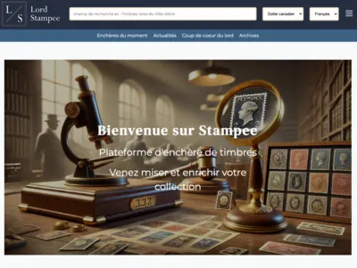
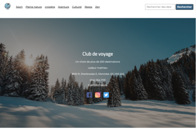

### **🚨 À la recherche d’un stage 🚨**

## 🚀 Développeur Web & Passionné d’Informatique  

💡 Depuis toujours, la technologie me fascine. Aujourd’hui, je suis **développeur web** avec une approche polyvalente : autant à l’aise côté serveur qu’en front-end !  
📍 Actuellement en formation en **conception et programmation de sites web** au Québec.  

---

## 🛠️ Compétences  

### 🖥️ Back-end & Serveurs  
🔹 **PHP avec Laravel (MVC)**  
🔹 **PHP & MySQL** pour la gestion de bases de données  
🔹 **Utilisation de MySQL Workbench & phpMyAdmin**  
🔹 **Gestion de serveurs** : expérience avec **Apache, Nginx** et la configuration des en-têtes de sécurité  
🔹 **Docker** : réalisation d’un projet de **cluster Docker Swarm** sur Raspberry Pi  

### 🎨 Front-end & Design  
🔹 **HTML, CSS**, avec une bonne dose de créativité  
🔹 **JavaScript**, mais préférence pour **TypeScript** et sa rigueur  
🔹 Expérimentation avec des **techniques avancées en CSS** (ex : `:has()`)  
🔹 **Figma** pour la conception d’interfaces  

### 🔐 Cybersécurité & Environnement Unix  
🔹 Passionné par la **cybersécurité** et souhaitant me perfectionner sur **Root-Me**  
🔹 À l’aise dans l’écosystème **Unix** (utilisation de **Arch Linux** sur PC et **macOS** sur Mac)  

---

## 🚀 Mes projets  

  
  
 

---

## 🌍 Me contacter  

  
📩 [Me contacter](mailto:TekGeek_dev@protonmail.com)

---

## 🎯 Autres centres d’intérêt  

- 🍓 J’ai monté un **cluster de Raspberry Pi** et l’ai rendu accessible sur Internet  
- 🛡️ Passionné de cybersécurité, je pratique sur **Root-Me**  
- 🛠️ J’aime **bricoler et réparer mes souris ou modifier mes PC** ! [🔧 Voir une de mes modifications](./projetSwitchRemplacement/README.md)  

---