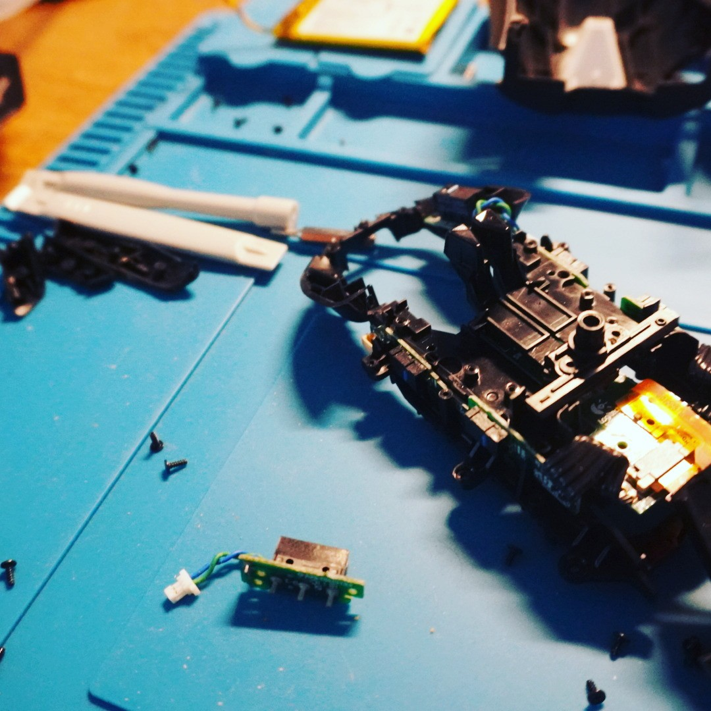
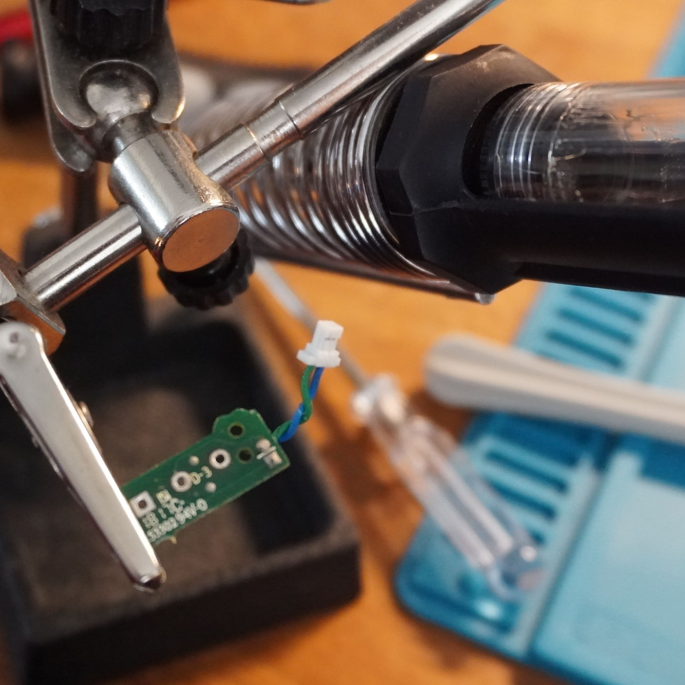
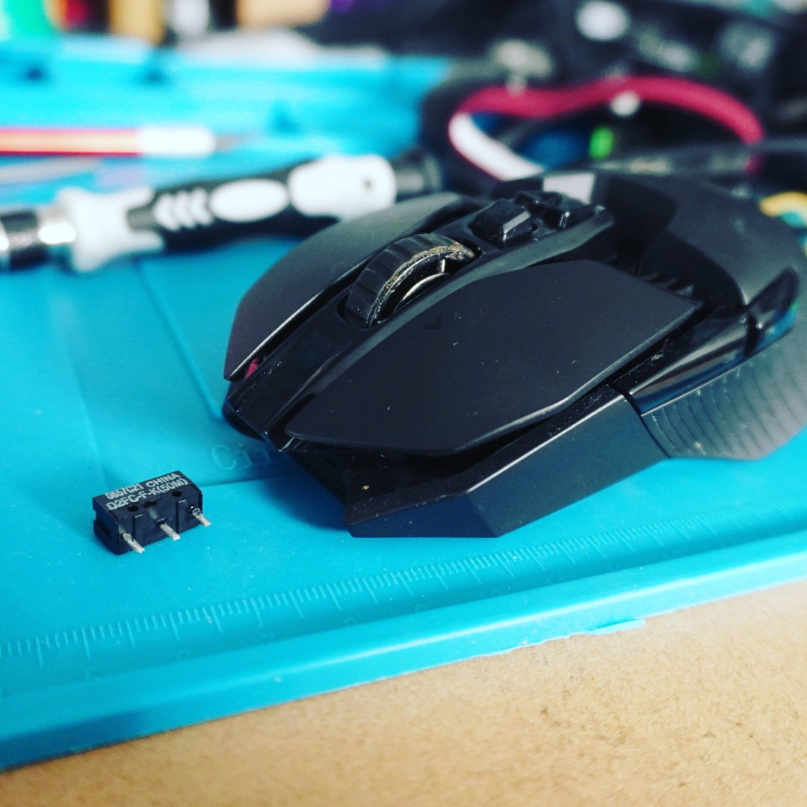

# 🖱️ Réparation Logitech G903 - Remplacement des Switchs

## 🔧 Problème rencontré

J'ai constaté un symptôme de double-clic sur ma souris Logitech G903. Après analyse, le problème venait des switchs défectueux.

## 🔨 Solution apportée

J'ai procédé au remplacement des switchs en réalisant les étapes suivantes :

- Démontage de la souris
- Désoudage des switchs défectueux
- Soudage de nouveaux switchs
- Remontage et test du fonctionnement

## 📸 Images du processus

Voici quelques images illustrant les étapes du remplacement :

## ✅ Résultat

Après remplacement, le problème de double-clic a été entièrement résolu, et la souris fonctionne parfaitement.

## 📢 Remarque

Si vous avez un problème similaire, assurez-vous d'utiliser des switchs de qualité et de bien maîtriser la soudure pour éviter tout dommage à la carte électronique.

---

[Retour vers l'acceuil](../README.md) 

