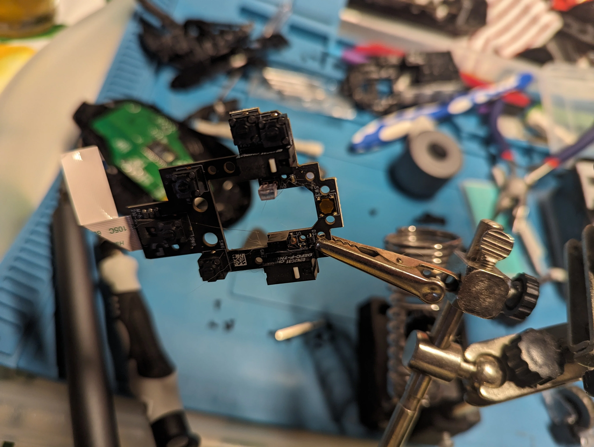
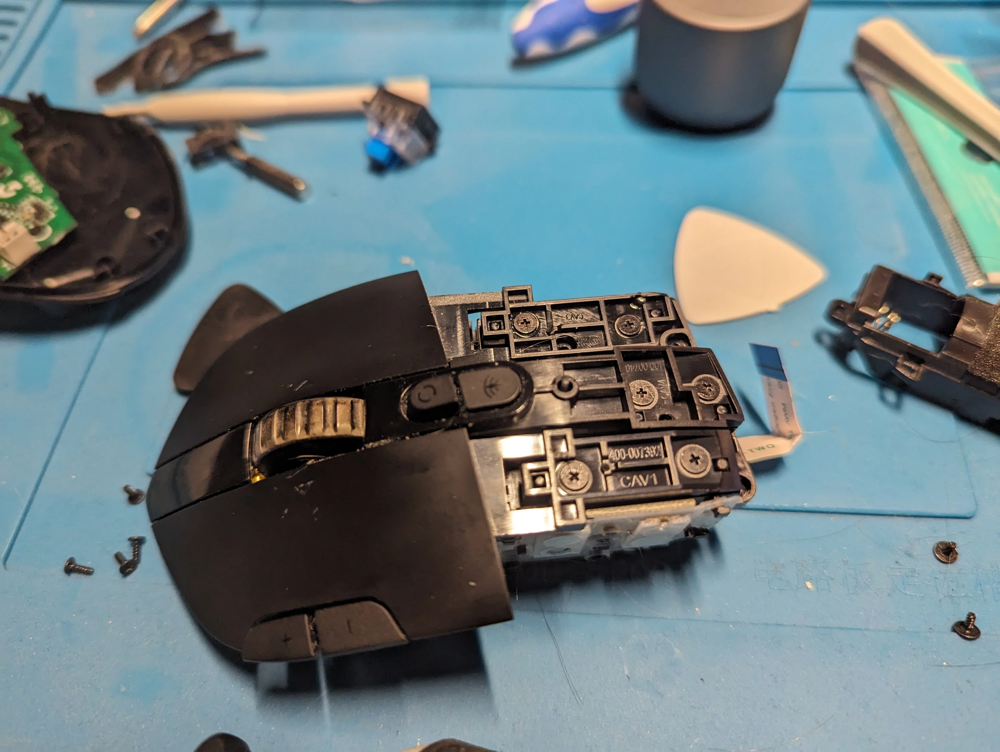
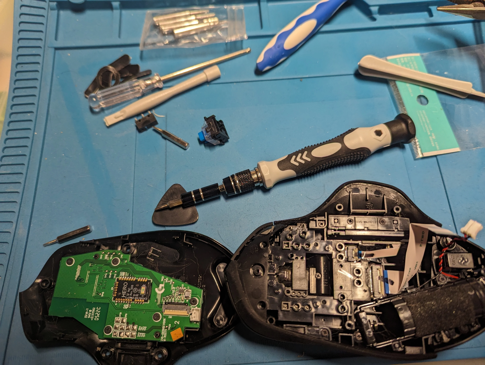

# 🖱️ Réparation Logitech G604 - Remplacement des Switchs

## 🔧 Problème rencontré

J'ai constaté un symptôme de double-clic sur ma souris Logitech G604. Après analyse, le problème venait des switchs défectueux.

## 🔨 Solution apportée

J'ai procédé au remplacement des switchs en réalisant les étapes suivantes :

- Démontage de la souris
- Désoudage des switchs défectueux
- Soudage de nouveaux switchs
- Remontage et test du fonctionnement

## ⚠️ Une difficulté majeure

Par rapport à d'autres modèles comme le G903, le Logitech G604 présente un niveau de difficulté bien supérieur en raison du nombre impressionnant de vis nécessaires au démontage. On peut estimer qu'il y avait entre le double et le triple de vis par rapport à une souris classique, certaines étant situées dans des emplacements particulièrement difficiles à atteindre. Cela a rendu le démontage bien plus complexe et long que prévu.

## 📸 Images du processus

Voici quelques images illustrant les étapes du remplacement :

## ✅ Résultat

Après remplacement, le problème de double-clic a été entièrement résolu, et la souris fonctionne parfaitement.

---

[Retour vers l'acceuil](../README.md) 